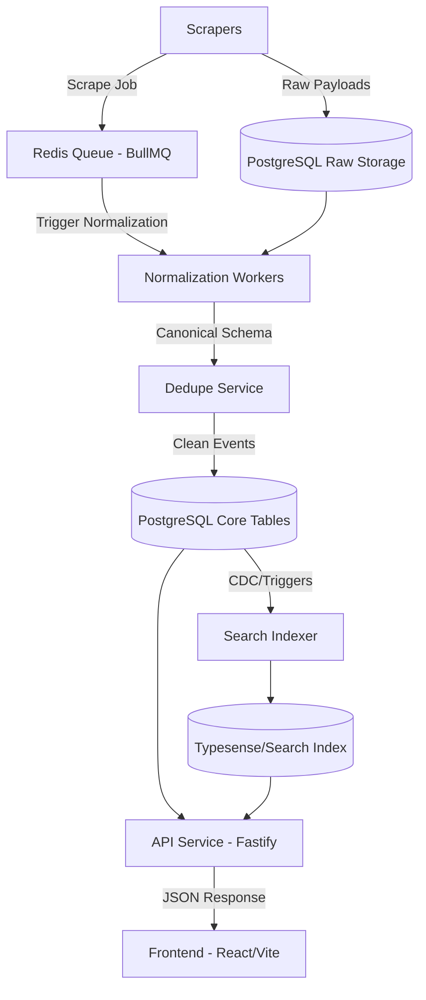

# System Overview

## Eventio: Event Intelligence Platform

Eventio is a production-grade scalable event intelligence platform designed to aggregate, normalize, and serve event data across multiple platforms. 

## Core Architecture

The platform follows a modular monolith architecture, divided into distinct decoupled packages and services to ensure long-term maintainability.

### High-Level Data Flow

### Components

1. **Frontend (`apps/web`)**: React + Vite + TypeScript + Tailwind. Serves as the user-facing application.
2. **API (`apps/api`)**: Fastify + TypeScript backend. Handles frontend requests, caching, and database reads. Never writes directly to the ingestion pipeline.
3. **Workers (`apps/workers`)**: Background workers processing BullMQ queues for scraping, normalization, and deduplication.
4. **PostgreSQL**: Primary data store for both raw event payloads and normalized, deduped canonical events. Uses Neon for serverless scaling.
5. **Redis / BullMQ**: Manages state, task queuing, and API response caching.

### Key Principles
- **No direct DB access from frontend**: All interactions must go through the API.
- **Raw data preservation**: Scrapers must store exact JSON payloads before any normalization.
- **Resilient queues**: All processing happens asynchronously via BullMQ with proper retry strategies.
- **Idempotent normalization**: Processing a raw payload multiple times should yield the same result.
